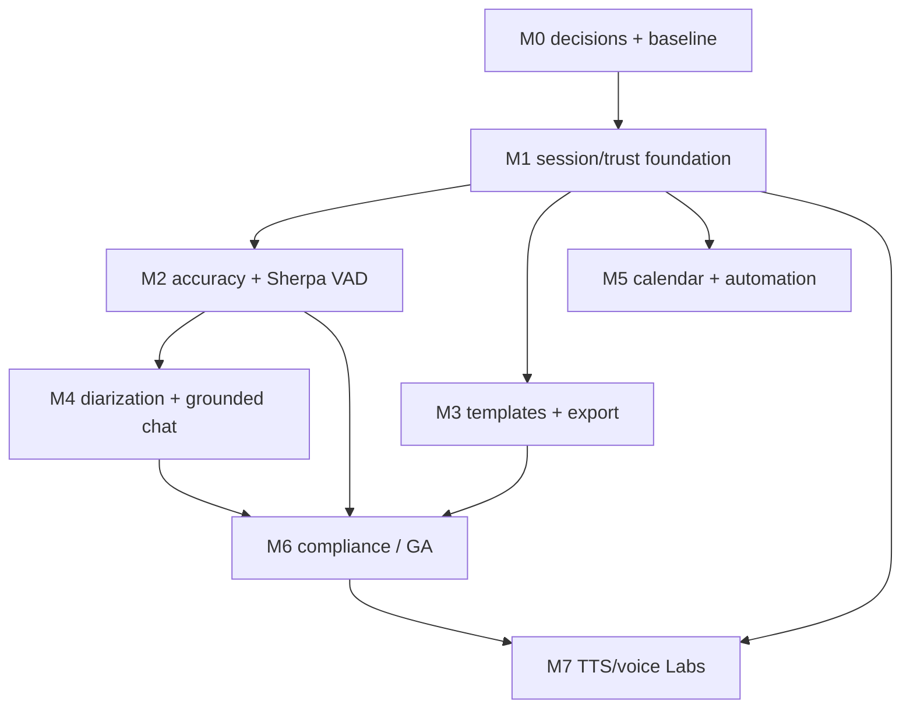

# Meetily Pro — Milestones / Roadmap

> **Trạng thái:** đề xuất lập kế hoạch • **Ngày:** 2026-08-07
> Ước lượng dưới đây dùng sprint 2 tuần và một nhóm tối thiểu gồm 1 Rust/audio engineer, 1 frontend engineer, 1 ML/QA engineer và product/security review. Nếu ít người hơn, giữ thứ tự phụ thuộc và kéo dài thời lượng; không cắt các gate về consent, benchmark hay bảo mật.

## Bản đồ phát hành

| Mốc phát hành | Milestone | Giá trị người dùng | Không được bỏ qua |
|---|---|---|---|
| **Internal Alpha** | M0–M1 | Session thay cho meeting-only, dữ liệu/tin cậy có nền | Quyết định license, threat model, secret store, migration không phá dữ liệu |
| **Pro Core Beta** | M2–M3 | ASR/VAD có benchmark, mode lớp/pháp thoại, template và export | Rollback Silero, glossary review, golden export tests |
| **Pro Intelligence Beta** | M4 | Diarization vô danh, chat có trích dẫn | Audio fan-out, citation-only answers, human relabel |
| **Automation Beta** | M5 | Detect/remind, calendar có consent | Không unattended auto-join; OAuth token ở OS keychain |
| **Pro GA** | M6 | GDPR-ready controls, release observability, tài liệu vận hành | DPIA/legal review, retention/delete/export, audit verification |
| **Voice Labs** | M7 | TTS accessibility; clone giọng có consent nếu được duyệt | Tách khỏi GA, anti-impersonation gate, model/license review |

`M7` không là dependency cho Pro GA. Generic TTS có thể phát hành sớm hơn trong M7 nếu policy/QA đã đạt; voice cloning luôn là feature tách và opt-in.

---

## M0 — Quyết định sản phẩm, license, security baseline

**Ước lượng:** 1 sprint (2 tuần)
**Mục tiêu:** khóa các quyết định nếu sai sẽ làm lại đắt tiền.

### Deliverables

1. ADR về ranh giới MIT Core / Pro proprietary và entitlement offline/online.
2. Product brief: persona, session modes, scope của “auto-detect/join”, thị trường/platform đầu tiên.
3. Data-flow map: capture → ASR → LLM → export; ghi rõ local, optional cloud và data controller/processor.
4. Threat model cho audio, calendar OAuth, external LLM, chat, voice profile và artifact export.
5. Security gap report: SQLite API keys, filesystem permission rộng, chính sách privacy có placeholder/claim cần xác thực.
6. Benchmark protocol và corpus manifest **không chứa dữ liệu riêng tư trong Git**.
7. Sherpa spike design: pin dependency, architecture sidecar, licenses/NOTICE, target OS/CPU matrix.

### Exit criteria / go–no-go

- Owner chấp thuận phương án A hoặc B cho Pro code; không bắt đầu code licensing trước khi có ADR.
- Legal/privacy owner xác định lawful basis, consent wording, retention defaults và phạm vi của “GDPR-ready”.
- Có corpus được cấp quyền, consent hoặc synthetic; không dùng recording người dùng để benchmark mặc định.
- Security owner chấp thuận kế hoạch chuyển secrets vào OS credential store.
- Có test matrix ít nhất macOS Apple Silicon, Windows x64, Linux x64; support level được ghi rõ.

### Cards

`PRO-001` đến `PRO-006` trong [Kanban](./KANBAN.md).

---

## M1 — Session foundation và trust-by-design

**Ước lượng:** 1.5 sprint (3 tuần)
**Mục tiêu:** model dữ liệu có thể diễn tả meeting/lớp/pháp thoại, vẫn mở được toàn bộ meeting cũ.

### Scope

- Additive migration: `session_type`, metadata JSON có schema version, processing run/provenance, glossary và template version references.
- UI chọn mode khi tạo/import; existing meeting mặc định `meeting`.
- `SessionDocument`/`DocumentModel` canonical tách khỏi UI editor và renderer.
- `ProcessingRun`: engine, model artifact SHA/version, language hint, VAD config, source track, timestamps, quality metrics, operator/user choice.
- Credential abstraction dùng OS Keychain/Credential Manager/Secret Service; migration API keys từ SQLite và xoá column data sau verify.
- Consent receipt, recording notice, policy version, data route selection và audit event schema tối thiểu.
- Mode templates v0: standard meeting, online class, Dharma talk (bản tiếng Việt trước).

### Acceptance criteria

- Một meeting v0.4.0 được mở, edit, delete và export sau migration mà không mất transcript/summary/audio link.
- Khi provider cloud được chọn, UI hiển thị rõ dữ liệu nào rời máy và log route không chứa transcript.
- Test chứng minh secrets không còn được trả qua command/read từ DB plaintext; OAuth chưa được làm ở mốc này.
- Summary lưu template version và processing run; transcript gốc luôn còn.
- Dharma template có các loại block `exact_quote`, `summary`, `editorial_note`, `practice_note` và validator cấm citation rỗng cho `exact_quote`.

### Dependencies

M0 approvals; `PRO-005`, `PRO-007`–`PRO-013`.

---

## M2 — Accuracy pipeline và Sherpa VAD beta

**Ước lượng:** 2 sprints (4 tuần)
**Mục tiêu:** chất lượng có số đo, VAD/ASR được thay đổi có rollback, batch long-form hoạt động tốt cho lớp và pháp thoại.

### Scope

1. **Evaluation harness**
   - Normalisation policy công khai: Vietnamese punctuation/diacritics, English code-switching, Pāli/Sanskrit proper nouns.
   - Báo cáo WER/CER, entity/term accuracy, timestamp error, real-time factor, memory/CPU, dropped segments.
   - Slice corpus: online class, one-speaker Dharma talk, Q&A/multi-speaker, noise, low-volume, overlap, long silence.
2. **Model registry & quality profiles**
   - `live_balanced`, `high_accuracy_postprocess`, `Vietnamese_long_form`, `offline_only`.
   - Model manifest gồm source URL, SHA-256, license, supported languages, hardware requirement và deprecation state.
3. **Audio refactor đúng thứ tự**
   - Thêm `AnalysisAudioBus`/per-source track fan-out, timeline clock chung và bounded queues.
   - Không đổi playback mixed artifact hay format recording hiện có trong cùng một migration lớn.
4. **Sherpa POC → gated beta**
   - Sidecar `sherpa-bridge`; feature flag per session; Silero fallback khi bridge/model/health fail.
   - Benchmark Sherpa VAD với Silero trên cùng corpus; không promote chỉ vì feature list upstream.
5. **Domain correction UX**
   - Glossary candidate review, raw/normalized text diff, user-approved correction history.
   - Retranscribe batch dùng chosen accuracy profile và tạo processing run mới, không overwrite bí mật kết quả cũ.

### Acceptance criteria

- Không mất transcript trong shutdown, pause/resume, Bluetooth reconnect và sidecar crash test.
- Mọi run mới ghi engine/model/config/track provenance; user có thể xem/re-run một run.
- Sherpa VAD chỉ bật default cho profile khi đạt non-regression threshold đã ký trong M0; ngoài ra chỉ opt-in beta.
- Smart auto-pause không mặc định, có pre-roll và test case long silence/quiet speech/meditation.
- Báo cáo benchmark tái lập được từ manifest + command, chỉ chứa metrics/anonymised sample IDs trong CI.

### Dependencies

M1 processing schema; `PRO-014`–`PRO-022`.

---

## M3 — Custom workflow, templates và advanced export

**Ước lượng:** 1.5 sprints (3 tuần)
**Mục tiêu:** biến transcript thành tài liệu dùng được trong công việc, học tập và lưu trữ.

### Scope

- Template studio: create/edit/duplicate/archive/import/export, JSON Schema validation, preview với fixture, version pin per session, locale/role variables.
- Bundled templates: meeting, online class, Dharma talk, study-group Q&A; custom template không ghi đè silently bundled template.
- `DocumentModel` renderer:
  - Markdown lossless / human-readable;
  - DOCX native styles, table/list/heading;
  - PDF render path chọn sau POC cross-platform.
- Export wizard: scope (transcript/summary/notes/audio links), privacy banner, destination picker, filename sanitizer, atomic write, export audit event.
- Citation/timestamp links và speaker labels xuất hiện thống nhất ở ba format.

### Acceptance criteria

- Cùng một fixture tạo semantic-equivalent Markdown/DOCX/PDF, verified bằng golden/snapshot + manual visual smoke trên supported OS.
- Export không mở network connection và không đính raw audio trừ khi người dùng tick rõ.
- Template selection không reset về `standard_meeting` sau reload; session biết template ID + version đã dùng.
- Dharma talk export phân biệt rõ content AI summary với exact transcript quote và note cá nhân.

### Dependencies

M1 document/metadata foundations; `PRO-023`–`PRO-029`.

---

## M4 — Diarization và chat có căn cứ

**Ước lượng:** 2.5 sprints (5 tuần)
**Mục tiêu:** người dùng hiểu ai đang nói và hỏi lại một session mà không biến LLM thành nguồn bịa đặt.

### Scope

#### Diarization beta

- Chạy diarization trên per-source analysis tracks; không dùng mixed mono như nguồn duy nhất.
- Speaker turns với `speaker_id` vô danh (`Speaker 1`, `Speaker 2`), confidence, overlap và model/run provenance.
- UI timeline label/relabel/merge/split; manual correction có ưu tiên hơn model.
- “Speaker identification” (tự gán tên thật qua voice biometric) **không nằm trong beta**. Chỉ cho người dùng đặt tên nhãn thủ công.

#### Grounded chat beta

- Local embedding/index provider, scope mặc định là session hiện tại; workspace search là opt-in.
- Retrieval trả segment ID/timestamp trước khi gọi LLM; renderer bắt buộc citation cho factual claim.
- Answer categories: answer with evidence, uncertain, no evidence, refused by policy.
- LLM routing screen: local model hoặc external provider do người dùng chọn; data route/audit rõ ràng.
- Queries useful: “đoạn nào nói về…?”, “tóm tắt Q&A”, “liệt kê bài tập có nguồn”, “trích đoạn lời giảng về…”.

### Acceptance criteria

- Diarization corpus report công bố DER/overlap performance và manual correction flow; không show person identity như model fact.
- 100% answer test fixture có claims về nội dung phải render citation hợp lệ; no-evidence fixture không được hallucinate.
- Index được invalidated/rebuilt khi transcript chỉnh, segment split/merge hoặc retention delete.
- Voice embeddings từ diarization không được tái sử dụng làm voice-clone profile.

### Dependencies

M2 analysis tracks/provenance; M1 privacy route; `PRO-030`–`PRO-037`.

---

## M5 — Calendar và meeting automation beta

**Ước lượng:** 2 sprints (4 tuần)
**Mục tiêu:** giúp người dùng không bỏ lỡ phiên mà không tạo bot thu âm/join ngầm.

### Scope theo thứ tự an toàn

1. Import `.ics`/CalDAV read-only hoặc local calendar discovery trước OAuth.
2. Google/Microsoft calendar OAuth với least scopes, token trong OS credential store, connect/disconnect/revoke UI.
3. Pre-session notification, title prefill, mode/template suggestion và **one-click Start Recording**.
4. Window/process/audio-activity detector local, chỉ báo “có thể là session”, không capture title/content khi chưa được phép.
5. “Join link” chỉ mở URL do user xác nhận. Không tự điền credential, không unattended join, không bypass waiting room/recording policy.

### Acceptance criteria

- Không có token trong SQLite, log, crash report hay export.
- Một calendar event có thể được disconnect/revoked và dữ liệu cache bị xoá theo retention policy.
- Mọi automation có setting opt-in, notification/indicator và audit event không chứa nội dung session.
- Test platform policy/ToS and recording-notice UX được legal/product sign-off.

### Dependencies

M1 secret/audit base; `PRO-038`–`PRO-042`.

---

## M6 — Privacy, compliance readiness và Pro GA

**Ước lượng:** 2 sprints (4 tuần)
**Mục tiêu:** GA có kiểm soát kỹ thuật chứng minh được, không chỉ marketing claim.

### Scope

- Retention policy theo artifact type; scheduled deletion có retry/idempotency và proof in audit log.
- Subject access/export/delete flow cho local single-user và chuẩn bị workspace/self-hosted mode.
- Append-only/tamper-evident audit trail (hash chain hoặc storage equivalent đã được security review); never put raw transcript/audio in audit events.
- At-rest protection decision implemented and documented (OS-protected key + encrypted artifacts/database where supportable); update policy to wording chứng minh được.
- SBOM, third-party notices, model license manifest, dependency vulnerability process, signed update/release verification.
- DPIA/ROPA, privacy policy, DPA/subprocessor disclosures for any cloud route; external security review and accessibility QA.
- Recovery/backup/delete tests and operator runbook.

### Exit criteria / GA gate

- Legal/security approve documents and evidence; nếu không, gọi release là beta, không “GDPR compliant”.
- Pen test/threat-model findings high/critical đã fix hoặc formally accepted with expiry.
- Export, delete, retention, audit verification and disaster recovery drills pass.
- Supported OS/hardware/model matrix and known limitations published.
- No P0/P1 bug in capture, data loss, consent or authorization flows during beta soak period.

### Dependencies

M1 onward; `PRO-043`–`PRO-049`.

---

## M7 — TTS và controlled voice-cloning Labs

**Ước lượng:** 2.5–3 sprints (5–6 tuần), chỉ bắt đầu sau M0 policy gate và ưu tiên sau GA
**Mục tiêu:** accessibility playback trước; clone giọng chỉ khi quyền và model safety chứng minh được.

### Scope tách hai cấp

| Cấp | Có thể phát hành | Điều kiện |
|---|---|---|
| **TTS accessibility** | Đọc summary/flashcards/transcript bằng generic voice local; tốc độ/ngôn ngữ, file export có nhãn synthetic | License model rõ ràng, UI disclosure, QA pronunciation/language, opt-in content route. |
| **Voice cloning Labs** | Tạo profile giọng **của chính người dùng hoặc người có quyền** cho scope đã đồng ý; synthesize local, label synthetic | Identity/consent receipt, scope/expiry/revocation, encrypted profile, delete proof, abuse review, legal sign-off. |

### Hard safety gates

- Không enrollment tự động từ audio meeting/pháp thoại; không clone default một vị giảng sư, public figure hoặc người thứ ba.
- Không dùng diarization embedding cho clone; dataset/profile là luồng consent riêng.
- Chặn minors, impersonation/deception use cases và export không nhãn; watermark chỉ là requirement nếu model thật sự hỗ trợ, không quảng cáo nếu không.
- Audit enrollment/synthesis/export không chứa sample audio; user có thể revoke và xoá profile/model cache.
- Nếu không có model tiếng Việt chất lượng + license phù hợp, chỉ ship generic TTS hoặc giữ Labs tắt.

### Acceptance criteria

- Red-team test impersonation/revocation/delete pass; security/legal owner ký launch checklist.
- UI hiển thị “Audio tổng hợp — không phải giọng gốc”; metadata export có provenance.
- TTS fail gracefully về generic voice, không upload source voice sang cloud without explicit route consent.

### Dependencies

M1 secret/audit; M6 controls; `PRO-050`–`PRO-054`.

---

## Parallel work và critical path

- **Critical path đến GA:** M0 → M1 → M2/M3/M4 → M6.
- M3 và một phần M5 có thể chạy song song sau M1.
- Không để TTS/voice-clone kéo lùi accuracy, data protection hoặc core export.

## Dừng/điều chỉnh scope khi nào?

| Trigger | Quyết định |
|---|---|
| Sherpa VAD không vượt/không bằng Silero hoặc làm bundle/latency quá xấu | Giữ Silero, ship model registry + benchmark, chỉ quay lại Sherpa khi có model/build phù hợp. |
| Không có corpus tiếng Việt/pháp thoại đủ quyền | Không claim professional accuracy cho domain đó; ship glossary/manual correction trước. |
| PDF renderer không ổn định cross-platform | Ship Markdown + DOCX GA, giữ PDF beta hoặc export HTML/print-to-system có disclosure. |
| Calendar provider/ToS không cho auto join | Giữ reminder + user-confirmed open link; không xây workaround. |
| Legal/security chưa duyệt clone giọng | Tắt Labs; generic TTS không mặc định tạo profile clone. |
| Compliance controls chưa hoàn tất | Chỉ gọi beta/private preview, không dùng nhãn GDPR compliant. |
