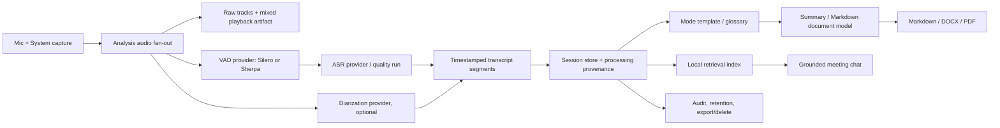

# Meetily Pro — định hướng sản phẩm và kiến trúc

> **Trạng thái:** Đề xuất để lập kế hoạch, chưa phải cam kết phát hành
> **Ngày khảo sát:** 2026-08-07 (UTC)
> **Thuật ngữ:** trong bộ tài liệu này, “plan stone” được hiểu là **milestone / roadmap**; “handoff” là tài liệu bàn giao cho đội triển khai.

## 1. Mục tiêu sản phẩm

Nâng Meetily từ một ứng dụng ghi biên bản cuộc họp thành trợ lý học và nghe có căn cứ, vẫn **local-first**:

- **Meeting:** quyết định, việc cần làm, người phụ trách.
- **Lớp học trực tuyến:** mục tiêu học tập, dàn ý bài giảng, khái niệm, hỏi–đáp, bài tập và việc cần ôn.
- **Pháp thoại Phật Pháp:** chủ đề, thuật ngữ Pāli/Sanskrit/Hán–Việt, trích đoạn có mốc thời gian, hỏi–đáp và thực hành/ghi chú cá nhân được phân biệt rõ với lời giảng.

Một bản Pro tốt không chỉ “tạo tóm tắt đẹp”; nó phải cho người dùng quay về **đoạn âm thanh hoặc transcript làm chứng** cho từng nội dung quan trọng, kiểm soát nơi dữ liệu được xử lý, và không tự nhận là nguồn diễn giải giáo lý có thẩm quyền.

### Nguyên tắc bắt buộc

1. **Session-first, không meeting-only.** Giữ tương thích bảng/URL hiện tại nhưng thêm loại phiên (`meeting`, `online_class`, `dharma_talk`, `other`) và metadata theo loại.
2. **Evidence-first.** Tóm tắt, chat, trích dẫn và xuất bản phải lưu provenance: segment, mốc thời gian, model, template và lần xử lý.
3. **Local-first, cloud là lựa chọn minh bạch.** Không gửi audio/transcript sang nhà cung cấp ngoài nếu người dùng chưa chọn provider và chấp thuận tuyến xử lý đó.
4. **Con người kiểm duyệt nội dung nhạy cảm.** Không tự “sửa” tên riêng, thuật ngữ Phật học, câu kinh/kệ hay danh tính người nói mà không hiển thị bản gốc và cơ chế chấp nhận sửa đổi.
5. **Không thu âm/join bí mật.** Tự phát hiện chỉ được dùng để nhắc hoặc chuẩn bị; phiên ghi âm và mở link tham gia phải có chỉ báo/đồng ý rõ ràng của người dùng.
6. **Voice cloning là Labs có rào chắn.** Không suy ra quyền clone từ một bản ghi; chỉ cho phép chủ giọng đã xác minh/chấp thuận theo phạm vi, có thể thu hồi và xoá.

## 2. Kết quả khảo sát repo hiện tại

| Hạng mục | Hiện trạng tìm thấy | Ý nghĩa cho Pro |
|---|---|---|
| Ứng dụng | Tauri 2 + Rust tại `frontend/src-tauri`, Next.js/React tại `frontend/src`; `backend/` đã được ghi rõ là archive | Phát triển trên Tauri commands/events, **không** mở rộng FastAPI legacy. |
| Thu âm | Mic + system audio, trộn audio, checkpoint/recovery và transcript có mốc thời gian | Nền tốt cho session offline; cần fan-out track phân tích trước khi trộn để diarization đáng tin cậy. |
| VAD | `audio/vad.rs` dùng `silero_rs`; `audio/pipeline.rs` đã gửi speech segment thay vì im lặng | Sherpa phải là provider có feature flag/fallback, không thay nóng pipeline ổn định. |
| ASR | Whisper (`whisper-rs`) và Parakeet/ONNX; `audio/transcription/provider.rs` đã có trait provider | Có điểm mở để chuẩn hoá metadata chất lượng và thêm engine/model chuyên nghiệp. |
| Batch/import | Import/retranscribe audio có decode, VAD, cancel, progress và giới hạn 20 GB | Phù hợp để xử lý pháp thoại/lớp dài sau buổi học. |
| Tóm tắt | Template JSON có sẵn, gồm built-in và thư mục custom; UI mới chỉ chọn template | Cần CRUD/version/preview/per-session template, glossary và template theo ngữ cảnh. |
| Lưu trữ | SQLite local, transcript và folder recording; migration đã có `speaker` dạng cột | Chưa đủ processing provenance, speaker turns, audit, retention hoặc knowledge index. Không dùng cột `speaker` hiện hữu như danh tính người nói. |
| Xuất | Có copy transcript và mở folder; không thấy pipeline PDF/DOCX/Markdown chuẩn hoá | Cần canonical document model rồi mới render ba định dạng. |
| Chat/calendar/auto-join/TTS/Sherpa/audit | Không thấy implementation đang hoạt động trong source path chính | Là scope mới, không nên quảng cáo là đã có. |
| Bảo mật dữ liệu | `SettingsRepository` đang lưu API key trong các cột SQLite; `PRIVACY_POLICY.md` có ngày placeholder và claim encryption chưa được chứng minh bởi code | Chặn mốc “GDPR compliant” cho tới khi migrate secrets, chính sách/kiểm thử và review pháp lý hoàn tất. |

### Các điểm chạm triển khai quan trọng

- Audio live: `frontend/src-tauri/src/audio/pipeline.rs`, `audio/vad.rs`, `audio/recording_manager.rs`.
- ASR/import: `audio/transcription/{provider,engine,worker}.rs`, `audio/import.rs`, `whisper_engine/`, `parakeet_engine/`.
- Summary/templates: `summary/templates/`, `summary/template_commands.rs`, `hooks/meeting-details/useSummaryGeneration.ts`.
- Data/commands: `database/`, `api/api.rs`, command registration tại `src/lib.rs`.
- Bundle: `src-tauri/tauri.conf.json` đã có cơ chế `externalBin`, hiện dùng cho `llama-helper` và `ffmpeg`.

## 3. Quyết định kiến trúc cần chốt ở Milestone 0

Các lựa chọn đã chốt sau kickoff được ghi tại [DECISIONS.md](./DECISIONS.md). Pro sẽ phát triển open source trong repo này, ưu tiên Pro Core cho lớp học/pháp thoại, local mặc định với cloud opt-in, và generic TTS trước voice cloning.

### 3.1 Phân phối Pro và mã nguồn MIT

README hiện công bố repo theo MIT. Bất kỳ mã Pro nào commit vào repo MIT sẽ có thể được tái sử dụng theo giấy phép đó. Vì vậy cần chốt một trong hai phương án trước khi viết entitlement/licensing:

- **A — Pro vẫn open source:** tính phí support, model bundle, self-hosted service hoặc tiện ích vận hành; code ở repo này vẫn MIT.
- **B — Pro thương mại tách riêng (khuyến nghị nếu có feature proprietary):** giữ core interface và cải tiến không độc quyền ở repo này; app/sidecar/plugin Pro, entitlement và dịch vụ thương mại ở repo private/package riêng. Không commit mã proprietary vào repo hiện tại.

Bất kể lựa chọn nào, capability checks phải ở một `EntitlementProvider` rõ ràng, có chế độ offline signed-license và không làm mất quyền truy cập dữ liệu cũ khi license hết hạn.

### 3.2 Mô hình session và luồng xử lý đề xuất

**Điểm thay đổi then chốt:** pipeline hiện trộn mic + system trước VAD/ASR. Diarization sau audio mono trộn sẽ không phân biệt đáng tin cậy người ở local và remote. Pro cần một `AnalysisAudioBus` giữ track mic/system đã đồng bộ cho phân tích (có thể là artifact tạm mã hoá), trong khi vẫn giữ mixed audio cho playback. Điều này cũng giúp tái xử lý bằng model tốt hơn mà không phá recording hiện có.

## 4. Tích hợp Sherpa-ONNX: đề xuất an toàn và có thể rollback

Fork được yêu cầu tại [Pabhassaracitto/sherpa-onnx](https://github.com/Pabhassaracitto/sherpa-onnx) công bố local ASR, VAD, diarization, speaker functions và TTS; source tại thời điểm khảo sát là `6897144f087712d0972648fb9ece6ca211b5ee41`, giấy phép Apache-2.0. Sherpa là runtime/model ecosystem; **TTS hoặc voice cloning có khả năng hay không phụ thuộc model được chọn và giấy phép model**, không được giả định chỉ vì đã bundle Sherpa.

### Thiết kế tích hợp

1. POC dùng **sidecar `sherpa-bridge`** bọc Sherpa C API/Rust API, giao tiếp bằng binary length-delimited IPC qua stdin/stdout hoặc named pipe — không mở TCP port.
2. `SherpaSupervisor` trong Tauri quản lý handshake, model manifest, backpressure, restart và telemetry local không có nội dung audio.
3. Tạo trait riêng `VoiceActivityProvider`/`SpeechSegmentationProvider`; không nhét Sherpa vào `TranscriptionProvider` chỉ vì cùng dùng ONNX.
4. Giữ Silero là fallback; `vad_engine = silero | sherpa` là feature flag theo session và có nút rollback.
5. Pin commit/release, tạo SBOM/NOTICE và review license cho **từng model** trước khi download/bundle.

### VAD “ngắt ghi âm thông minh”

- V1 chỉ dùng VAD để segment/transcribe và đánh dấu im lặng.
- “Auto-pause” là **opt-in**, có ngưỡng cấu hình, pre-roll ít nhất 5 giây, trạng thái UI rõ ràng và không tự xoá raw audio.
- Không auto-stop một lớp hay pháp thoại chỉ vì im lặng: thiền, suy ngẫm, âm lượng nhỏ và chuyển chủ đề là nội dung hợp lệ.
- Promotion chỉ khi benchmark cho thấy không tăng word loss so với Silero hiện tại.

## 5. Ba content mode đầu tiên

| Mode | Metadata & đầu ra bắt buộc | Rào chắn chất lượng |
|---|---|---|
| **Meeting** | quyết định, action item, owner, deadline, open question | Action item phải trỏ về segment hoặc được đánh dấu là AI suy luận. |
| **Online class** | môn/bài, mục tiêu, dàn ý, thuật ngữ, ví dụ, Q&A, bài tập/ôn tập | Không bịa bài tập/câu trả lời; phần “cần xác minh” phải tách riêng. |
| **Dharma talk** | giảng sư/nguồn do người dùng nhập, chủ đề, thuật ngữ Pāli/Sanskrit/Hán–Việt, trích nguyên văn có timestamp, Q&A, thực hành cá nhân | Phân biệt `trích nguyên văn`, `tóm tắt`, `ghi chú biên tập`; không tự gán kinh/nguồn hoặc “chỉnh giáo lý” không có bằng chứng. |

Glossary là tài sản cục bộ theo workspace/profile: canonical spelling, biến thể, loại thuật ngữ, source và trạng thái review. Hệ thống gợi ý sửa ASR nhưng chỉ áp dụng sau khi người dùng duyệt và vẫn lưu raw transcript.

## 6. Tiêu chí thành công (đặt baseline trước, rồi chốt SLO)

Các con số dưới đây là **mục tiêu để benchmark xác nhận**, không phải claim hiện tại:

- Chất lượng ASR: giảm tối thiểu 20% WER/CER tương đối so với baseline đã khóa cho tập tiếng Việt/lớp học/pháp thoại có quyền sử dụng; báo cáo riêng proper noun và Pāli/Sanskrit.
- Live transcription: p95 từ cuối speech segment đến transcript hiển thị dưới 3 giây trên hardware support đã công bố; không mất segment trong test shutdown/reconnect.
- Diarization beta: DER được báo cáo theo corpus; chỉ phát hành khi nhãn vô danh + sửa tay tốt hơn transcript không nhãn. Không tự gán danh tính thật.
- Grounded chat: 100% câu trả lời khẳng định về nội dung session phải có citation segment/timestamp; câu không có bằng chứng trả lời “không tìm thấy trong phiên”.
- Export: Markdown/DOCX/PDF cùng một document model, có title, mode, provenance tối thiểu và snapshot/golden tests; không âm thầm gửi dữ liệu ra ngoài.
- Privacy: default không có network content egress; access token/API secret không còn nằm trong SQLite plaintext; export/delete/retention/audit được test end-to-end.

## 7. Những việc cố ý chưa cam kết trong v1

- Bot tự vào Zoom/Teams/Meet không có hành động người dùng, hoặc bypass chính sách nền tảng.
- Nhận diện danh tính người nói bằng sinh trắc học mặc định.
- Voice clone từ recording/pháp thoại của người thứ ba, trẻ vị thành niên, người nổi tiếng hay giảng sư không có consent rõ ràng.
- Tuyên bố “GDPR compliant” chỉ dựa trên local storage hoặc audit log kỹ thuật.
- Đưa raw corpus lớp/pháp thoại riêng tư vào Git hoặc telemetry.

## 8. Tài liệu thực thi

- [Quyết định đã chốt](./DECISIONS.md)
- [Benchmark protocol](../../benchmarks/README.md)
- [Milestones / roadmap](./MILESTONES.md)
- [Kanban khởi tạo](./KANBAN.md)
- [Handoff kỹ thuật, data model, risk và first sprint](./HANDOFF.md)
